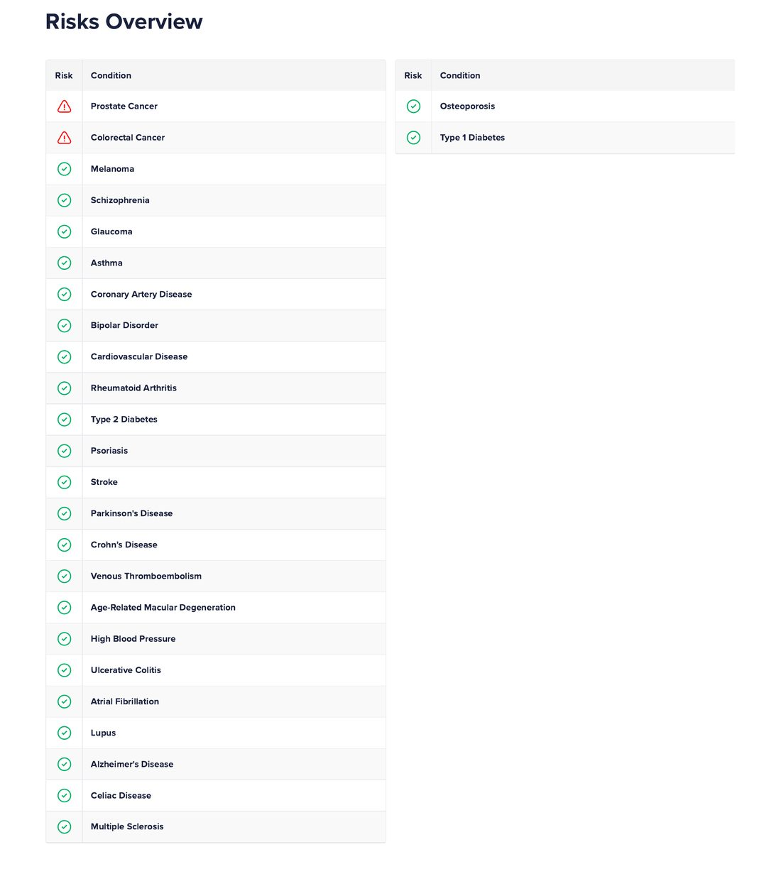

# Handoff: VivatDNA × Kynetic site

Paste this whole file into a new chat along with the `vivatdna-kynetic-site.zip`
(or just this unzipped folder) and the Clinical Overview PDF you want to add.
Everything a fresh chat needs to pick up exactly where this one left off is here.

## What this is

A static, customer-facing landing site for VivatDNA (a DNA testing kit) and
Kynetic (an AI daily-longevity-coaching layer on top of it). Plain HTML/CSS/JS,
no build step, deploys straight to GitHub Pages. Not framed as an investor
pitch anywhere in the copy, on purpose (see "Content decisions" below).

```
vivatdna-kynetic-site/
├── index.html               ← all page content lives here (289 lines)
├── README.md                 ← GitHub Pages deployment + domain setup steps
├── HANDOFF.md                 ← this file
└── assets/
    ├── css/styles.css        ← all styling, design tokens at the top (437 lines)
    ├── js/main.js             ← typewriter console, scroll reveals, form handling
    ├── img/                   ← logo, favicon, 3 report screenshots
    └── reports/
        └── VivatDNA-Sample-Health-Overview.pdf   ← real sample, already live
```

## The one open task: add the Clinical Overview report

The site currently ships the **Health Overview** report (both as 3 screenshot
previews in the gallery and as a downloadable PDF). The **67-page Clinical
Overview** is the second report VivatDNA produces (polygenic risk, pharma-
cogenomics, carrier status) and it's referenced throughout the copy but marked
"coming soon" because the file was too large for the chat that built this site.

### Exactly what to do with the new PDF

1. **Save the PDF** into `assets/reports/` as:
   `VivatDNA-Sample-Clinical-Overview.pdf`

2. **Open `index.html`, find this block** (currently around line 125, inside
   the `<section class="vivat" id="vivat">` block, in `.reports-download-row`):
   ```html
   <span class="btn btn-outline-dark btn-disabled" title="Coming soon">↓ Full Clinical Overview (PDF) · coming soon</span>
   ```
   Replace it with a real link, same pattern as the Health Overview button
   right above it:
   ```html
   <a class="btn btn-outline-dark" href="assets/reports/VivatDNA-Sample-Clinical-Overview.pdf" target="_blank" rel="noopener">↓ Download full sample: Clinical Overview (PDF)</a>
   ```

3. **Replace the placeholder preview card.** Find (in `.reports-grid`, the 4th
   card):
   ```html
   <div class="report-card report-card--placeholder reveal">
     <div class="report-card__frame">
       <div class="placeholder-inner">
         <span class="icon">67-page document</span>
         <h4>Clinical Overview sample</h4>
         <p>Full polygenic risk, pharmacogenomics &amp; carrier-status report. Preview coming soon.</p>
       </div>
     </div>
   </div>
   ```
   Export one or two representative pages of the new PDF as `.jpg` (same
   process used for the other three: rendered at ~150dpi, resized to 1100px
   wide, saved at quality ~82 to keep file size reasonable, see "How the
   existing screenshots were made" below), drop them in `assets/img/` as
   e.g. `report-clinical-01.jpg`, and swap the placeholder markup for a real
   card matching its three siblings exactly:
   ```html
   <div class="report-card reveal">
     <div class="report-card__frame"></div>
     <div class="report-card__body">
       <h4>[Section name shown in the screenshot]</h4>
       <p>[One sentence, same voice as the other three captions]</p>
     </div>
   </div>
   ```

4. **Sanity check after editing:**
   - No leftover `btn-disabled` or "coming soon" text for this report
   - The `.report-card--placeholder` CSS class becomes unused — fine to leave
     the CSS in place (harmless) or strip it, your call
   - Re-open `index.html` in a browser and confirm both download buttons work
     and the gallery now shows 4 real cards

### How the existing screenshots were made (for consistency)

The original 3 screenshots came from converting the Health Overview PDF pages
with `pdftoppm -png -r 150`, then resizing to 1100px wide and re-saving as
JPEG quality 82 with Pillow. If the new chat has code execution, ask it to do
the same for the Clinical Overview PDF so all 4 cards look visually consistent
(same resolution, same crop style, same file size range ~100–150KB each).

## Design system reference (so new work matches)

All tokens are CSS custom properties at the top of `assets/css/styles.css`:
- **Colors**: `--cream` (#F3F0E7 background), `--navy-900/800/700` (brand
  navy, from the logo), `--gold-300/500/700` (brand gold, from the logo),
  `--kynetic-400/500/900` (a distinct indigo/blue used *only* in the Kynetic
  section, to visually separate "the data" from "the AI layer")
- **Type**: Fraunces (display/headlines), Inter (body), IBM Plex Mono
  (labels, stats, eyebrows, code-like details) — loaded from Google Fonts
- **Signature element**: the typewriter "console" in the Kynetic section
  (`#typewriter` in JS) cycles real example daily-instructions from the
  product's own materials, styled like a terminal
- Any new section should reuse `.eyebrow`, `.status-pill`, `.btn` variants,
  `.stat-card` / `.hero__stat` patterns already defined rather than inventing
  new ones

## Content decisions made in this project (context for future edits)

These were deliberate calls made across the last few rounds of work. Worth
knowing before changing copy:

1. **This is a customer-facing site, not an investor pitch**, by explicit
   instruction. No fundraising language, no "raising $X," no valuation talk,
   no capital roadmap. The "What's Next" section is a real *product* roadmap
   (kit shipping → Kynetic beta → lab uploads → clinic/practice accounts),
   not a funding-round roadmap. If asked to make it more investor-compelling,
   the approach has been: let real product depth and honesty do that work
   (real report screenshots, real science citations, a real live demo link)
   rather than pitch language.
2. **No pricing is shown**, per explicit request. Was previously $199 kit /
   $29 mo, removed from hero stats and the product section. If reintroducing,
   the natural spots are `.hero__stats` and near the `.product-head` in the
   Vivat section.
3. **No mention of OmicsEdge or SelfDecode** (the actual lab/data partners)
   anywhere in the public copy, per explicit request. Currently phrased as
   "accredited clinical-grade lab infrastructure, the same standard used in
   institutional pharmacogenomics programs" instead.
4. **No em dashes anywhere in the copy** (a specific style note from the
   founder) — the site uses commas, periods, colons, or a middle dot `·`
   (matching the brand's own "VIVAT DNA · KYNETIC" formatting) instead.
   Please keep this convention in any new copy.
5. **No fabricated testimonials.** There's a testimonial slot near the
   waitlist section, styled to look intentional, that honestly says
   real feedback will go there once it exists. Don't fill it with invented
   quotes attributed to fictitious people even if asked casually to "add a
   testimonial" — flag this the way this chat did, and suggest the honest
   placeholder pattern instead, unless a real quote is provided.
6. **Redundancy pass already done once.** The same stats (26 conditions,
   50+ medications, 38 hereditary conditions) used to appear in 3 places;
   now they appear once, in the `.stat-strip` in the "Why Genetics-First"
   section. A "kit includes" 3-card block that duplicated the report gallery
   was removed entirely. Watch for this pattern (same fact restated in a new
   section) when adding content.
7. **The Kynetic "how it works" list is intentionally not styled as a
   completion checklist** (no green checkmarks). It used to have ✓ marks
   implying features were "done," which contradicted the roadmap section
   saying wearable/lab integration is still upcoming. Now it's a plain
   numbered 1-2-3-4 list describing what the product does, with no
   done/not-done claim. Keep this consistency if editing either section.
8. **A generalized "concierge medicine" mention** sits in roadmap step 4
   ("Practice & clinic accounts... clinicians, concierge medicine, and
   longevity practices"). This is a deliberate, non-attributed nod to a
   specific B2B2C channel discussed with the founder, kept generic
   intentionally — do not name any specific company or person here.
9. **Logo sizing**: was too small originally (26px in nav), increased to
   42px. Footer version of the logo has a light rounded "chip" background
   behind it since the logo PNG itself has a baked-in cream background (not
   transparent) and looks like a stray white box on the dark footer
   otherwise.

## Deployment (already covered in README.md, summarized here)

The user hosts this themselves on GitHub Pages (no AI tool has or should
have their GitHub credentials). Steps: create a public repo → drag-and-drop
this folder's contents via GitHub's web uploader (preserving the `assets/`
folder structure) → Settings → Pages → deploy from `main` branch, root →
add custom domain → point DNS (A records for apex domain, CNAME for `www`)
at GitHub Pages. Full detail in `README.md`.

The waitlist form (`#waitlist-form`) posts to a Supabase table via the REST
API directly from `assets/js/main.js` (no SDK, plain `fetch()`). This is
**already fully configured and live**: a dedicated Supabase project
(`vivatdna-kynetic-site`, ref `ojhxijyazqxmtkiebmse`) was created, the
`waitlist` table + RLS policy applied, and the real `SUPABASE_URL` /
`SUPABASE_ANON_KEY` are already in `main.js` — nothing left to activate.
The table schema and RLS policy (public can insert, nobody but the owner
can read) live in `supabase/waitlist_migration.sql` for reference. Full
detail, including a note on why `Prefer: return=minimal` must not be
removed, is in README.md section 5.

## Suggested first message in the new chat

> "Continuing work on the VivatDNA/Kynetic site. Here's the handoff doc and
> the current site files, plus the Clinical Overview PDF I want added as the
> second downloadable sample report. Please follow the steps in
> HANDOFF.md under 'The one open task' to integrate it."
